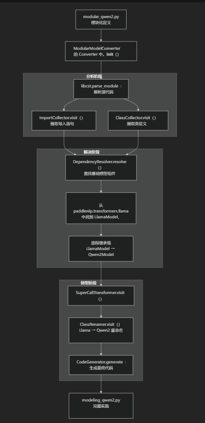

# PaddleNLP-modular
##目的
  本文档概述了 PaddleNLP 模块化系统，这是一个代码生成框架，可将模块化模型定义转换为完整的、独立的 Transformer 实现。该系统使开发人员能够通过模块化方法扩展现有基础模型、自动解决依赖关系并生成生产就绪代码来创建新的模型架构。
##什么是 PaddleNLP-modular
  PaddleNLP-modular 是一个复杂的代码转换系统，它弥合了实验模型设计和可部署实现之间的差距。该系统采用继承自基础模型（主要是基于 Llama 的架构）的模块化模型定义，并生成完整的、独立的模型文件，其中所有依赖关系都已解析和集成。
  核心创新是能够通过仅指定与基础模型的差异来增量定义新的模型架构，同时系统自动处理依赖关系解析、代码转换和生成完整实现的复杂工作。
##关键组件
PaddleNLP 模块化系统由三个主要组件组成，它们协同工作以将模块化定义转换为完整的模型实现：

**核心组件概述：**
| 元件	| 代码实体	| 主要功能 |
|-------|----------|----------|
|模型转换器|	ModularModelConverter|	协调整个转型过程|
|块化定义	|modular_qwen2.py|	定义扩展基础模型的新模型架构|
|生成的输出	|modeling_qwen2.py|	完整的独立模型实现|
|导入分辨率|	ImportCollector	|识别并收集所有必需的进口|
|类处理	|ClassCollector|	提取和处理类定义|
|依赖关系管理|	DependencyResolver|	解析和集成外部依赖关系|
|代码转换|	SuperCallTransformer|	转换继承模式和方法调用|

**模型转换**
转换过程遵循系统工作流程，通过多个阶段的分析和代码生成来转换模块化定义：

**工作流程**
分析阶段：用于解析模块化定义文件，通过专门的访问者类提取导入和类定义。ModularModelConverterlibcst

解决阶段：标识基本模型组件并映射将在输出中扁平化的继承关系。DependencyResolverLlamaModelLlamaConfig

转换阶段：扩展复杂的继承模式，而类重命名将组件转换为等效组件，从而生成完整的独立实现。SuperCallTransformerLlama*Qwen2*

**生成的模型结构**
|生成的组件	|基础组件|	功能|
|----------|--------|-----|
|Qwen2Config|	LlamaConfig|	模型配置和超参数|
|Qwen2RMSNorm|	LlamaRMSNorm|	均方根归一化层|
|Qwen2Attention|	LlamaAttention|	具有 Qwen2 特定功能的多头注意力|
|Qwen2MLP|	LlamaMLP|	前馈网络实施|
|Qwen2DecoderLayer|	LlamaDecoderLayer|	完整的变压器块|
|Qwen2Model|	LlamaModel|	铁芯变压器模型|
|Qwen2ForCausalLM|	LlamaForCausalLM|	语言建模头|

**系统优势**
PaddleNLP 模块化方法具有几个关键优势：

*
增量开发：仅定义与基本模型的差异，而不是重新实现整个架构
*
依赖关系解析：自动解析和集成基础模型中的复杂依赖链
*
代码生成：生成完整的、独立的实现，准备进行训练和部署
*
可维护性：模块化定义比单体实现更容易理解、修改和维护
*
一致性：确保生成的模型实现的模式和约定一致